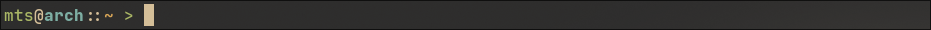

<h1 align="center">mts.zsh</h1>

<p align="center">personal <a href="https://ohmyz.sh/">oh-my-zsh</a> prompt theme</p>
<p align="center">
  
</p>
<br />

## prerequsities

- [zsh shell](https://www.zsh.org/)
- [oh-my-zsh](https://ohmyz.sh/)
- [nerd font](https://www.nerdfonts.com/)

## installation

clone this repo using:

```
git clone https://github.com/mtsdurica/mts.zsh.git
```
then create a symlink to oh-my-zsh's theme directory:

```
ln -s /path/to/repo/directory/mts.zsh-theme /path/to/oh-my-zsh/theme/directory/mts.zsh-theme
```

set `ZSH_THEME` in your `.zshrc` to `ZSH_THEME="mts"`.

## License

[MIT License](./LICENSE)